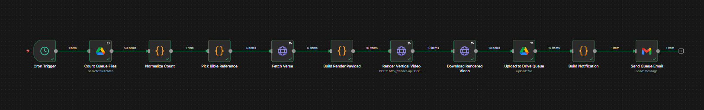
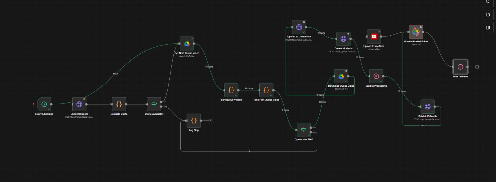
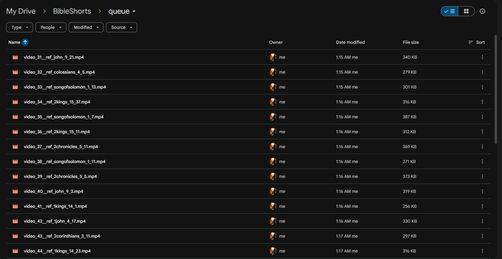
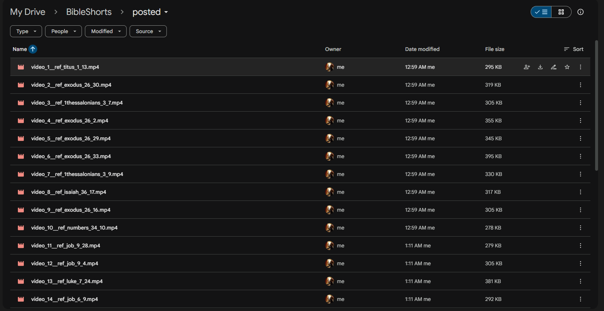

# Bible Shorts Automation With n8n

Production-style automation that generates vertical Bible short videos and publishes them through n8n workflows.

## What This Project Does
This repository contains two linked automations:

1. Creator workflow (`n8n/workflows/creator.json`)
   1. Picks random non-repeating Bible verses.
   2. Calls render API to create vertical videos.
   3. Uploads generated videos to Google Drive queue folder.

2. Publisher workflow (`n8n/workflows/publisher.json`)
   1. Reads queued files from Google Drive.
   2. Sorts videos by numeric index (`video_1`, `video_2`, ...).
   3. Publishes in configurable batches.
   4. Moves successfully published files to posted folder.

## Replication Requirements
Install and configure the following:

1. Docker Desktop
2. Google Drive API access in n8n credentials
3. Gmail or email credential in n8n (if queue email notifications are enabled)
4. Instagram Graph API setup (Professional account linked to Facebook Page)
5. Cloudinary account with unsigned upload preset

## Files Required To Replicate Exactly
These are the required files already present in this repository:

1. `docker-compose.yml`
2. `.env.local.example`
3. `.env.example`
4. `n8n/workflows/creator.json`
5. `n8n/workflows/publisher.json`
6. `render-service/` application files

Optional documentation assets:

1. `docs/images/creator.png`
2. `docs/images/publisher.png`
3. `docs/images/queue.png`
4. `docs/images/posted.png`

## Step-By-Step Replication (Local)
### 1) Create local env file

```powershell
Copy-Item .env.local.example .env
```

### 2) Fill `.env` values
At minimum, set all non-empty secrets and IDs:

1. `RENDER_API_KEY_INTERNAL`
2. `N8N_ENCRYPTION_KEY`
3. `INSTAGRAM_USER_ID`
4. `INSTAGRAM_PAGE_ID`
5. `FACEBOOK_PAGE_ID`
6. `INSTAGRAM_ACCESS_TOKEN`
7. `CLOUDINARY_CLOUD_NAME`
8. `CLOUDINARY_UNSIGNED_UPLOAD_PRESET`
9. `DRIVE_QUEUE_FOLDER_ID`
10. `DRIVE_POSTED_FOLDER_ID`

### 3) Start stack

```bash
docker compose up -d --build
```

### 4) Access services
1. n8n editor: `http://localhost:5678`
2. Render API health: `http://localhost:10000/health`

### 5) Import workflows in n8n
1. Import `n8n/workflows/creator.json`
2. Import `n8n/workflows/publisher.json`

### 6) Configure credentials inside n8n
1. Google Drive OAuth2 credential
2. YouTube OAuth2 credential (if YouTube publishing enabled)
3. Gmail/email credential (if notification node enabled)

### 7) Run order
1. Execute Creator to generate queue videos.
2. Execute Publisher to publish queue items and move them to posted.

## How The Automation Works
### Creator workflow
1. Counts existing files in queue and posted folders.
2. Tracks used verse IDs from filename suffix (`__ref_<id>`).
3. Selects random verse candidates excluding already used references.
4. Builds payload and renders videos using render API.
5. Uploads outputs to queue folder.

### Publisher workflow
1. Fetches all queue files.
2. De-duplicates by Drive file ID.
3. Sorts numerically by `video_<n>`.
4. Takes `BATCH_SIZE` items each run.
5. Uploads to Cloudinary and publishes to Instagram (or YouTube if enabled).
6. Moves successful files to posted folder.

## Workflow and Drive Screenshots

Creator workflow graph. Shows end-to-end generation from verse selection to queue upload and queue notification.


Publisher workflow graph. Shows quota check, queue sorting, batch selection, media publishing, and post-move archiving.


Queue folder contents. Files in this folder are pending publication and are processed in numeric order.


Posted folder contents. Files are moved here after successful publishing to prevent reprocessing.

## Configuration Notes
1. Batch size is controlled in `Take First Queue Video` node (`BATCH_SIZE`).
2. Queue order is enforced in `Sort Queue Videos` by parsing `video_<n>`.
3. No-repeat behavior is based on filename reference IDs plus queue/posted scan.
4. Keep `local-data/` out of git for security and portability.

## Troubleshooting
1. Instagram `Object does not exist`:
   1. Verify `INSTAGRAM_USER_ID` and token belong to the same linked account.
2. Instagram `Media ID is not available`:
   1. Increase wait node time and publish retry backoff.
3. Duplicate publish attempts:
   1. Confirm `Sort Queue Videos` dedupe logic and unique Cloudinary `public_id` are present.
4. Wrong processing order:
   1. Ensure filenames follow `video_<n>__ref_<id>.mp4`.

## Repository Structure
```text
.
├── .env.example
├── .env.local.example
├── .gitignore
├── docker-compose.yml
├── docs/
│   └── images/
├── n8n/
│   ├── Dockerfile
│   └── workflows/
│       ├── creator.json
│       └── publisher.json
├── render-service/
│   ├── Dockerfile
│   ├── requirements.txt
│   ├── start.sh
│   ├── app/
│   └── scripts/
└── render.yaml
```
